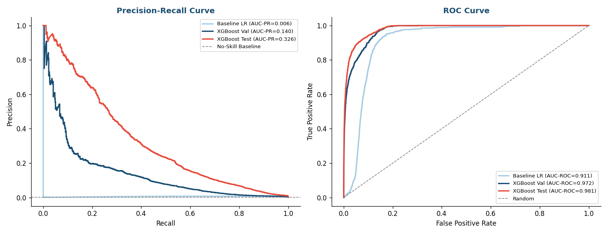
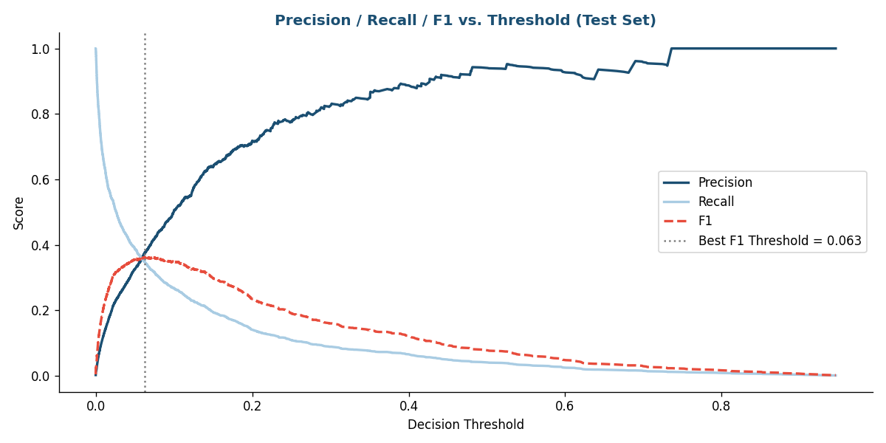
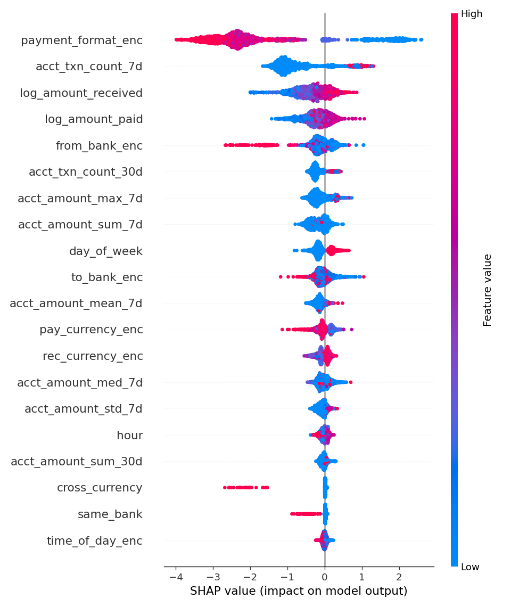
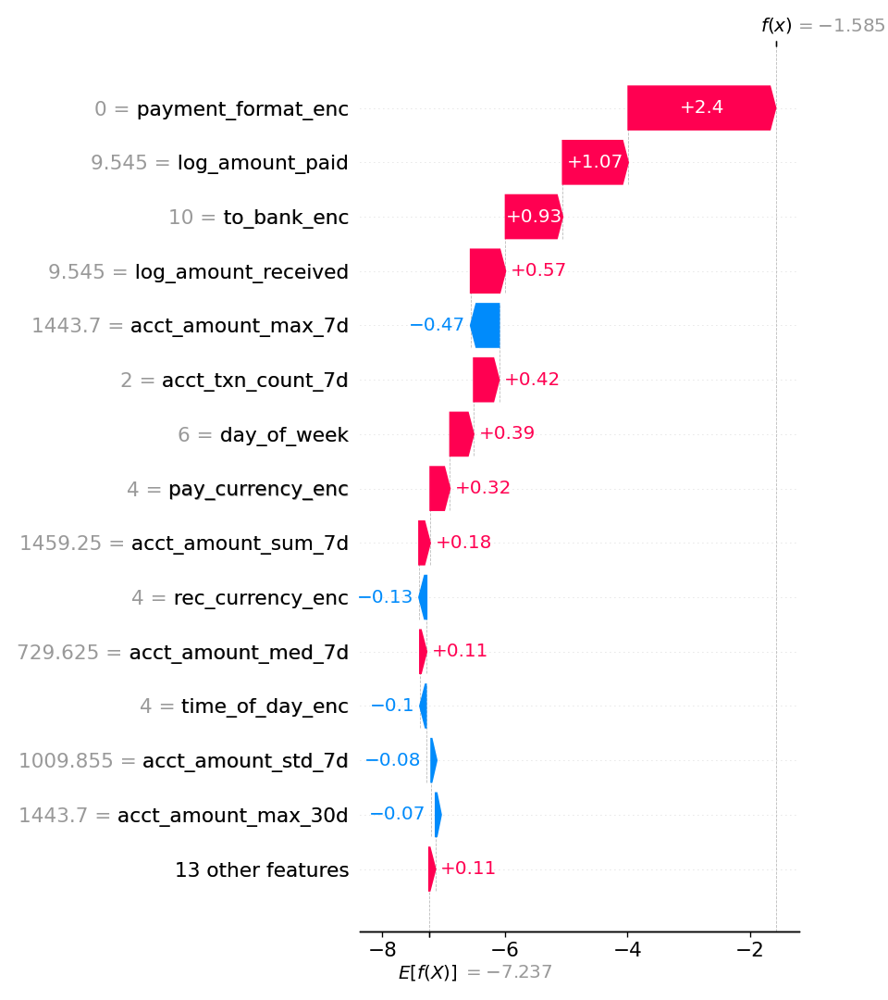

# ML-Based AML Detection with XGBoost and SHAP

A machine learning pipeline for detecting money laundering in financial transaction data, built on the IBM Synthetic AML dataset (5.07M transactions). The project combines a time-based train/val/test split to prevent temporal leakage, XGBoost with empirically tuned hyperparameters, and SHAP for transaction-level explainability.

Built as a portfolio project in the context of the Swiss regulatory framework (revDSG, AMLA).

---

## Results

| Model | AUC-PR | AUC-ROC |
|---|---|---|
| Baseline (Logistic Regression) | 0.006 | 0.911 |
| XGBoost (Val) | 0.139 | 0.972 |
| XGBoost (Test) | 0.321 | 0.980 |

At the F1-optimal threshold of 0.060:
* **Precision = $0.376$:** roughly 1 in 3 flagged transactions is genuine laundering
* **Recall = $0.354$:** the model detects approximately 1 in 3 laundering cases
* **Operational lift:** ca. 60x above the population base rate of 0.10%





---

## Key Findings

**`scale_pos_weight=1` outperforms the theoretically correct ratio ($ \approx 980 $).** Despite a 980:1 class imbalance, no class weighting correction produces the best validation AUC-PR. This is a consequence of temporal distribution shift: the fraud rate increases from 0.08% in train to 0.20% in test, meaning aggressive minority class weighting causes the model to overfit to training-period laundering patterns rather than learning signal that generalizes forward in time.

**Payment format and transaction frequency dominate.** SHAP analysis reveals `payment_format_enc` ($\overline{|\text{SHAP}|} \approx 2.2$) and `acct_txn_count_7d` ($ \approx 1.0 $) as the two strongest predictors, which is consistent with the AML literature on layering behavior and smurfing.





---

## Project Structure
aml_xgboost_shap/

├── config.py           # Hyperparameters, constants, paths

├── loader.py           # Dataset loading and caching

├── features.py         # Rolling behavioral features + row-wise engineering

├── models.py           # Logistic regression baseline, hyperparameter sweep, XGBoost

├── evaluation.py       # AUC-PR/ROC metrics and threshold selection

├── explainability.py   # SHAP value computation

├── visualization.py    # All plots (EDA, evaluation, SHAP)

├── main.py             # End-to-end pipeline

├── requirements.txt

└── aml_xgboost_shap.ipynb

---

## Installation

```bash
git clone https://github.com/alisonykim/aml-detection-with-xgboost-shap.git
cd aml-detection-with-xgboost-shap
python -m venv .venv
source .venv/bin/activate
pip install -r requirements.txt
```

---

## Usage

**Run the full pipeline:**
```bash
python main.py
```

Output plots are saved to `outputs/`. The engineered dataset is cached to `df_engineered.parquet` after the first run (ca. 10 min) and reloaded automatically on subsequent runs.

**Run the hyperparameter sweep** (disabled by default):
```python
# in main.py
RUN_SWEEP = True
```

**Explore interactively:**
```bash
jupyter notebook aml_xgboost_shap.ipynb
```

---

## Methodology

### Dataset
IBM Synthetic AML Dataset: 5,078,345 transactions across 17 days (September 2022), 0.10% fraud rate, 15 payment currencies, 7 payment formats. Synthetic data with no real identifying data.

### Features
27 features across four categories:
* **Temporal:** hour, day of week, weekend flag, time-of-day bucket
* **Amount:** log-transformed paid/received amounts, ratio, difference
* **Bank/currency:** same-bank flag, sending/receiving bank identity, cross-currency flag
* **Rolling behavioral (7d/30d):** transaction count; amount sum, mean, median, max, std per sending account

### Model Selection & Hyperparameter Sweep
A joint sweep over `max_depth` $ \in {4, 5, 6, 7, 8} $ and `scale_pos_weight` \in $ [1, 1500] $ selected on **validation AUC-PR only**. Best parameter values: `max_depth=7`, `scale_pos_weight=1`.

### Evaluation
Primary metric is **AUC-PR**, which is insensitive to the large negative class, unlike AUC-ROC which is inflated under class imbalance (Davis & Goadrich, 2006). Threshold selected by maximizing F1 on the test set.

### Explainability
SHAP TreeExplainer on a 2,000-row test sample. Beeswarm, bar, waterfall, and dependence plots expose both global feature importance and individual transaction explanations. This section is motivated by transparency requirements under the Swiss revDSG.

---

## Limitations

* **Synthetic data:** Results require validation on real transaction data
* **Temporal distribution shift:** Fraud rate triples from train (0.08%) to test (0.20%), making val and test AUC-PR not directly comparable
* **Static model:** Laundering patterns evolve; retraining and monitoring required
* **No network features:** Graph-level signals (transaction networks between accounts) are absent: a strong candidate for future work

---

## References

1. Davis, J. & Goadrich, M. (2006). The relationship between Precision-Recall and ROC curves. *ICML*.
2. FFIEC BSA/AML Examination Manual. https://bsaaml.ffiec.gov
3. Han, J., Huang, Y., Liu, S., & Towey, K. (2020). Artificial intelligence for anti-money laundering. *Digital Finance*, 2(3–4), 211–239.
4. Shwartz-Ziv, R. & Armon, A. (2022). Tabular data: Deep learning is not all you need. *Information Fusion*, 81, 84–90.